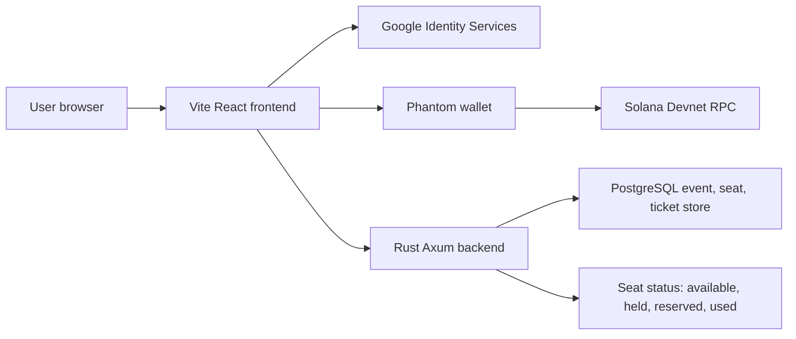
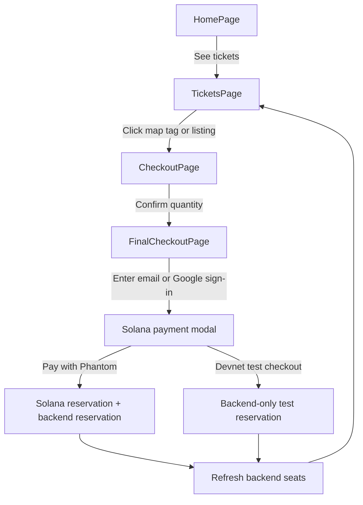
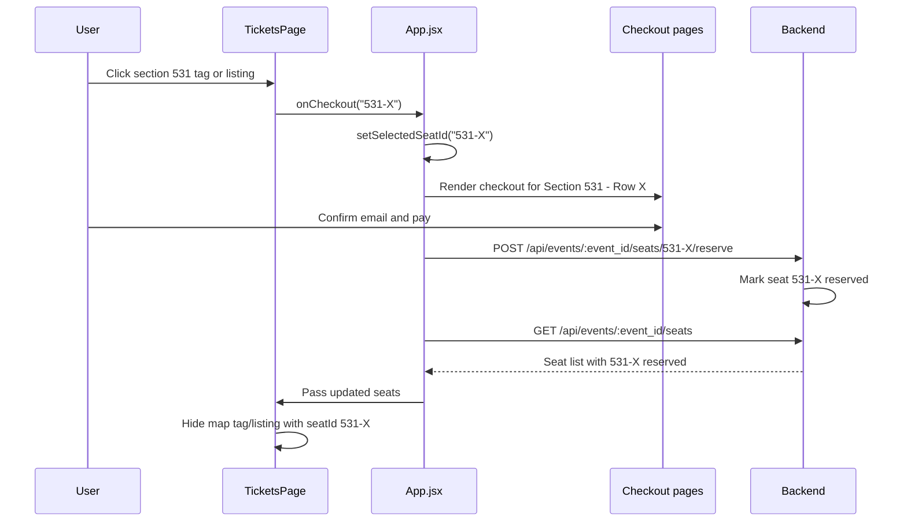
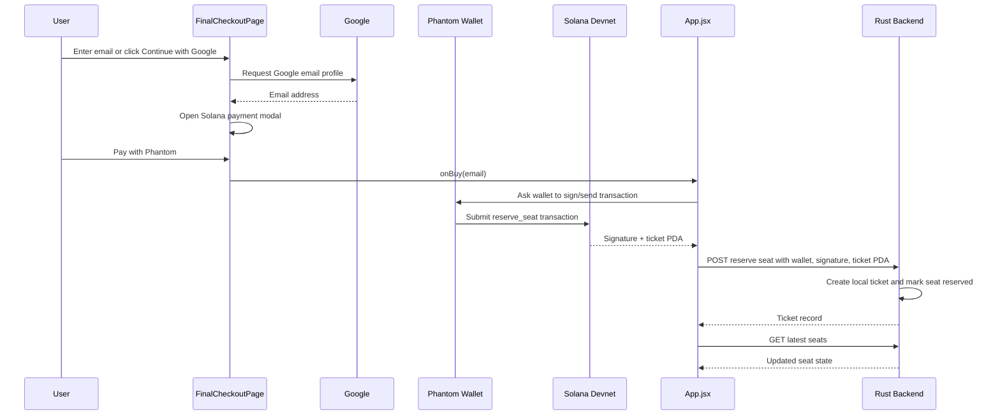
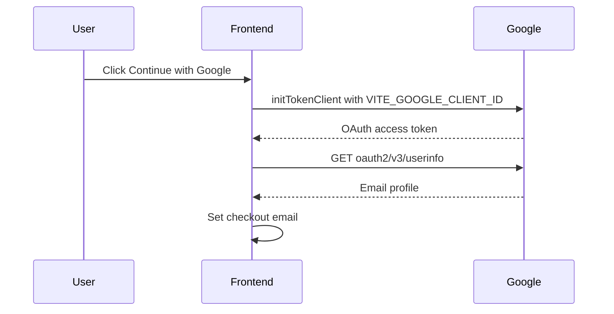
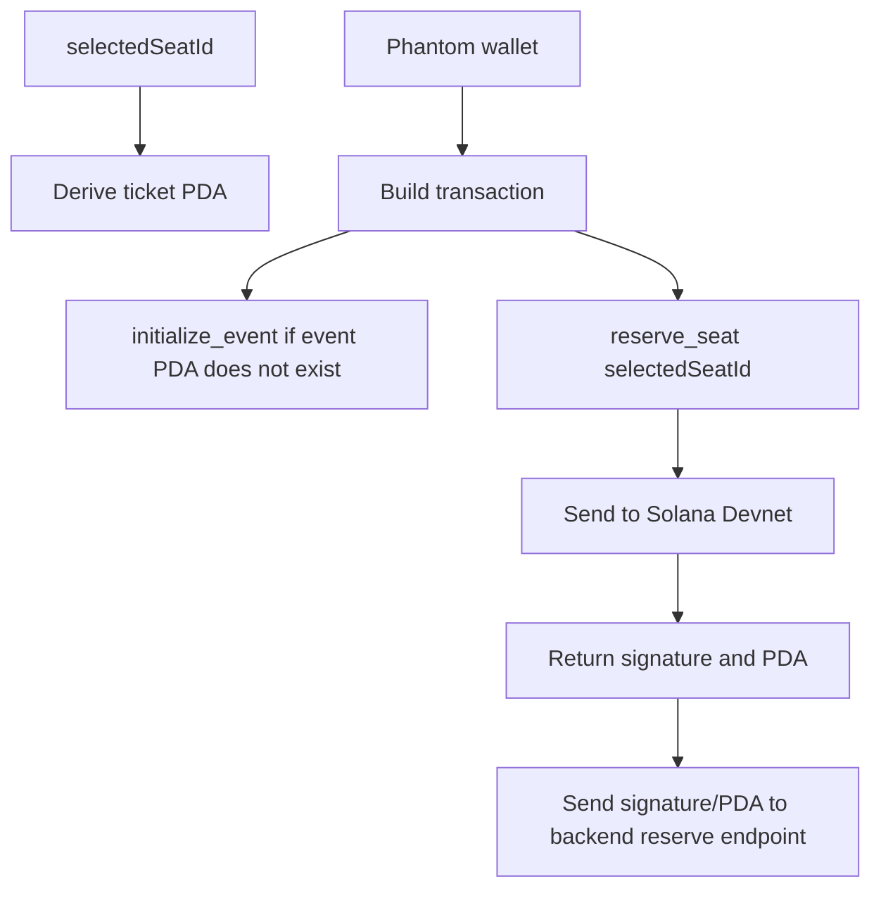
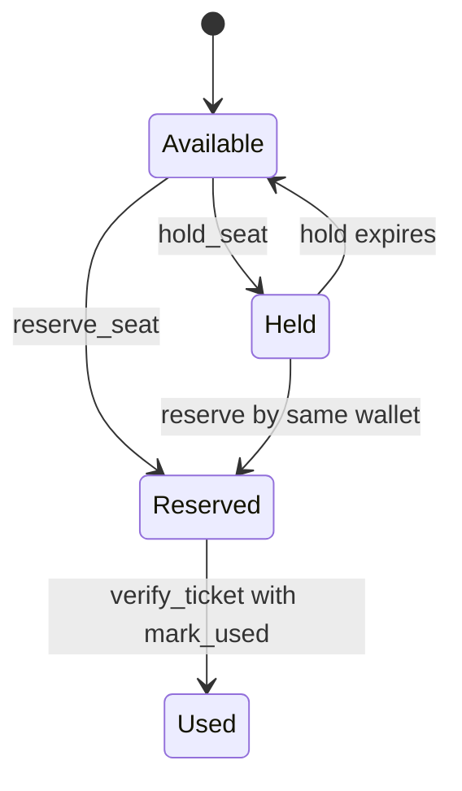
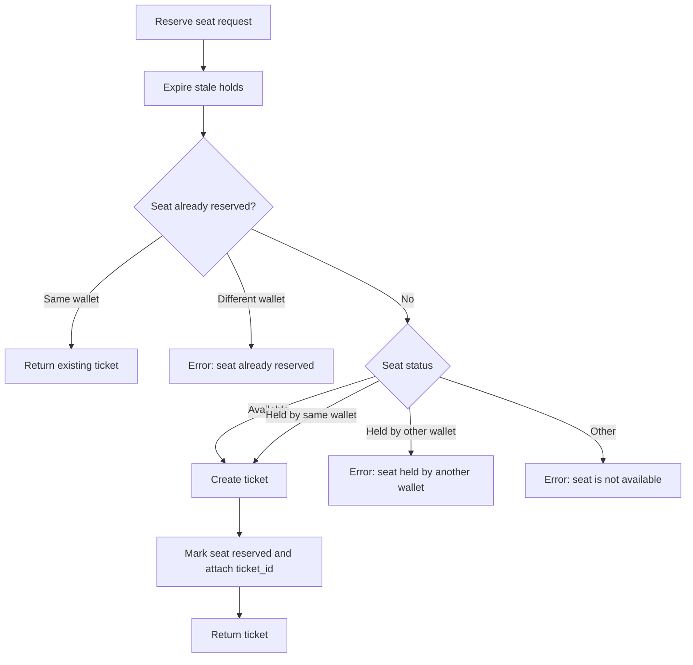
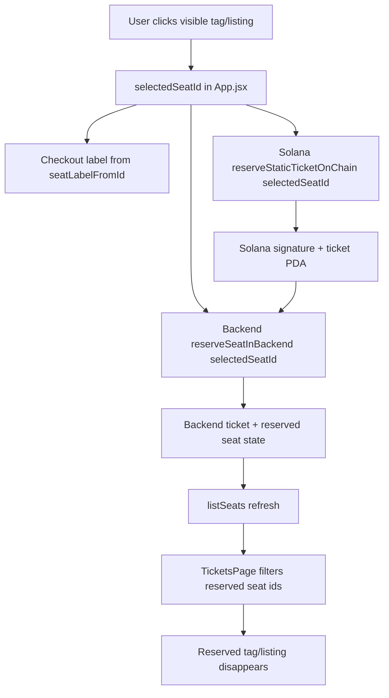

# Web3 Ticketing Handoff

This document maps how the current Web3 ticketing demo is connected. It is written for a third party who needs to understand the working prototype, the live workflow, and the next engineering steps.

## Current Stack

- Frontend: Vite + React in `src/`
- Backend: Rust + Axum in `backend/`
- Wallet / chain: Solana Devnet through `@solana/web3.js`
- Google sign-in: Google Identity Services, configured by `VITE_GOOGLE_CLIENT_ID`
- Seat map asset: `public/maps/fnb-stadium-map.svg`
- Local frontend URL: `http://127.0.0.1:5174`
- Backend API URL: `http://127.0.0.1:8090`

## High-Level System



The frontend drives the user experience. The backend owns the event inventory, seat status, and local ticket records. Solana Devnet signs and records the demo chain reservation data. Google is only used to confirm the checkout email.

## Frontend Page Flow



Relevant files:

- `src/App.jsx`: page state, selected seat state, buy actions, backend seat refresh
- `src/pages/HomePage.jsx`: event discovery page
- `src/pages/TicketsPage.jsx`: seat-map page, map tags, listings, reserved-seat hiding
- `src/pages/CheckoutPage.jsx`: selected ticket confirmation
- `src/pages/FinalCheckoutPage.jsx`: email, Google sign-in, Solana payment modal
- `src/components/TicketUi.jsx`: shared checkout header, order card, footer, map image component

## Seat Selection Flow



Important fix already applied: the selected seat is no longer hardcoded to `538-G`. A clicked tag or listing now maps to a concrete backend seat id and that id is used through checkout, Solana, and backend reservation.

Seat mapping lives in:

- `src/data/ticketData.js`
- `src/pages/TicketsPage.jsx`

Examples:

```text
Map/listing section 538 -> backend seat 538-G
Map/listing section 531 -> backend seat 531-X
Map/listing section 545 -> backend seat 545-ROW
Map/listing GA  -> backend seat GENERAL-ADMISSION-1
Map/listing FRONT -> backend seat FRONT-ZONE-NORTH-1
Default numbered section 541 -> backend seat 541-1
```

## Ticket Purchase Workflow



The app also has a demo fallback button:

- `Devnet test checkout`: skips Phantom and creates a backend reservation using a generated test payment signature.
- This is useful for demos when Phantom, Devnet SOL, or browser wallet permissions are blocking.

## Google Sign-In

Google sign-in is configured in `.env.local`:

```text
VITE_GOOGLE_CLIENT_ID=842289718082-fo06i7dnd946pjq0bcn61n3o58npbd2o.apps.googleusercontent.com
```

The code loads Google Identity Services from:

```text
https://accounts.google.com/gsi/client
```

Flow:



The Google Cloud OAuth client must include the local origins used by the app:

```text
http://127.0.0.1:5174
http://localhost:5174
http://127.0.0.1:5173
http://localhost:5173
```

## Solana / Web3 Integration

Relevant file:

- `src/services/solanaTickets.js`

The frontend uses:

- `@solana/web3.js`
- Solana Devnet RPC via `clusterApiUrl('devnet')`
- Phantom wallet through `window.solana`
- Program id: `35wzuQvuh6PkqoTe8sgZu8hx8cV4sG2G8h89zELaLmKD`

Current chain flow:



The backend stores the Solana result with the local ticket:

- `wallet_address`
- `payment_signature`
- `onchain_ticket_address`
- `metadata_uri`

## Backend API

Backend routes are defined in `backend/src/main.rs`.

```text
GET  /health
GET  /api/events
POST /api/events
GET  /api/events/:event_id/seats
POST /api/events/:event_id/seats/:seat_id/hold
POST /api/events/:event_id/seats/:seat_id/reserve
GET  /api/tickets/:ticket_id
POST /api/tickets/:ticket_id/transfer
POST /api/tickets/verify
```

Backend state model:



Backend data ownership:

- `events`: PostgreSQL table for event metadata such as name, venue, chain, price, resale cap
- `seats`: PostgreSQL table keyed by `(event_id, id)` for venue inventory and seat state
- `tickets`: PostgreSQL table for ticket records created after reservation
- `holds`: stored on each seat row as `hold_wallet_address` and `hold_expires_at`

The J. Cole demo event seeds a 90,000-seat inventory in `generate_jcole_seats()`.

## Backend Reservation Rules



## Seat Map Implementation

The current map asset is:

```text
public/maps/fnb-stadium-map.svg
```

Important limitation:

- The file is an SVG wrapper around one embedded PNG image.
- It does not contain real SVG paths like `<path id="section-541">`.
- Because of that, the app cannot read or color individual stadium sections directly from the SVG.

Current approach:

- Display the SVG/PNG as the visual map background.
- Place clickable price tags on top using absolute coordinates.
- Each tag maps manually to a backend seat id.
- Hide tags/listings when the backend says that seat id is reserved.

Future improvement:

- Rebuild or trace the venue as true SVG paths.
- Give each block an id, for example `section-541`, `section-GA`, `section-FRONT`.
- Bind section fill color directly to backend seat availability.
- Click the actual section shape instead of only the overlay tag.

## Data Flow Summary



## Local Runbook

Frontend:

```powershell
cd C:\Users\modja\OneDrive\Documents\reactprojects\web3-tickets
npm run dev -- --host 0.0.0.0 --port 5174
```

Backend:

```powershell
cd C:\Users\modja\OneDrive\Documents\reactprojects\web3-tickets\backend
cargo run
```

Open:

```text
http://127.0.0.1:5174
```

Verify backend:

```powershell
Invoke-RestMethod http://127.0.0.1:8090/health
Invoke-RestMethod http://127.0.0.1:8090/api/events
```

## What A Third Party Should Know

- The prototype now persists events, seats, tickets, holds, transfers, and scan state in PostgreSQL. Restarting the Rust backend no longer resets ticket state while the Postgres volume remains.
- The seat map image is not yet a real interactive vector map. Click targets are overlay tags.
- Google sign-in needs the configured OAuth client id and matching authorized JavaScript origins.
- Phantom must be installed and switched to Devnet for real wallet signing.
- The `Devnet test checkout` button is a demo fallback that reserves in the backend without Phantom.
- The backend currently trusts the frontend-provided Solana transaction result. A production version should verify the Solana transaction on the backend before creating the ticket.
- Production should move startup schema creation into migrations, consider Redis for high-volume holds, and add real NFT metadata/storage.
